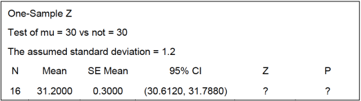

```{r setup, include=FALSE}
knitr::opts_chunk$set(echo = TRUE)
```
Solve the following problems.     

1. Why is randomization important in an experiment? Give an example.    
`Experimental design sits on three cornerstones.  One of which is randomization.  Randomization is a cornerstone of experimental design because it is a requirement of statistical methods to infer for the population from a sample.  Within a statistical method, test, or model the statistician or analyst requires that the observations are independently distributed random variables.  Only then, can the analyst draw inferences about the population from the sample.  An example showing randomization is the process of an ad website that funnels website visitors to differing versions of an advertisement based on random assignment.`     
2. Select an experiment of interest to you. State the problem, then select the response variable,
and choose the factors, levels, and ranges.     
`The experiment that I chose can be found here: https://www.gwern.net/Candy-Japan.  The problem described is CJ's to solve.  CJ has a Japanese Candy Box that he is trying to determine if the new packaging is associated with lower churn.  With lower churn, customers will stick around longer and will payoff the increase in packaging costs incurred from the flashier dress up of the candy box.  The response variable in the experiment was percent of cancellations of the Candy Box subscription during the testing period.  The factor in the experiment was the packaging layout of the Candy Box subscriptions.  There were two levels of the packaging layout.  One of the levels was plain-Jane packaging and the other level was the updated fanciful packaging. There were no ranges in the experiment.`       

3. Consider the computer output shown below.     

(a) Fill in the missing values in the output. What conclusion would you draw?      
`Z = (31.2 - 30) / (1.2 / sqrt(16))  =  ` `r (31.2 - 30) / (1.2 / sqrt(16))`     
`P = dnorm(x = 31.2, mean = 30, sd = 1.2 / sqrt(16)) = ` `r dnorm(x = 31.2, mean = 30, sd = 1.2 / sqrt(16))`

(b) Is this a one-sided or two-sided test?      
`This is a two-sided test due to the` $\neq$.    

(c) Use the output and the normal table to find a 99% Confidence Interval of the population
mean.     
```{r}
upper <- 31.200 + qnorm(p = 0.995) * 0.3 / sqrt(16)
lower <- 31.200 + qnorm(p = 0.005) * 0.3 / sqrt(16)
```
`99% Confidence Interval: (``r round(lower, 4)` `, ` `r round(upper, 4)``)`        

4. The breaking strength of a fiber is required to be at least 150 psi. Past experience has
indicated that the standard deviation of breaking strength is $\sigma$ = 3 psi. A random sample
of four specimens is tested, and the results are $y_{1}$ = 145, $y_{2}$ = 153, $y_{3}$ = 150, $y_{4}$ = 147.      
(a) State the hypotheses that you think should be tested in this experiment. Test these
hypotheses using $\alpha$ = 0.05.       
$H_{0} : \mu = 150$     
$H_{1} : \mu \leq 150$     

(b) What is the test statistic?      
`Z = (mean(c(145, 153, 150, 147) - 150)) / (3 / sqrt(4)) = ` `r round((mean(c(145, 153, 150, 147)) - 150) / (3 / sqrt(4)), 4)`      

(c) What are the critical values?    
`Critical Values = 150  - qnorm(0.95) * 3 / sqrt(4) = (` $-\infty$ `, ` `r 150 - qnorm(0.95) * 3 / sqrt(16)``)`     

(d) What is the P-value?    
`P-value : ` `r dnorm(x = -0.83333)`     

(e) What are your conclusions?      
`With a P-value lower than 0.05, there is sufficient evidence to reject the null hypothesis.  There does  appear to be evidence to suggest that the breaking strength is less than the required 150 psi.`     

(f) Find a 95% Confidence Interval of the population mean breaking strength.     
`95% C.I. : mean(c(145, 153, 150, 147)) +/- qnorm(0.975) * 3 / sqrt(4) = `      
`(` `r round(150 + qnorm(0.025) * 3 / sqrt(4), 4)` `, ` `r round(mean(c(145, 153, 150, 147)) + qnorm(0.975) * 3 / sqrt(4), 4)` `)` 