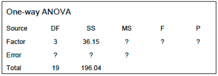

Solve the following problems.

1. In a single-factor ANOVA with $a$ levels, show that the total sum of squares $SS_{T}$ can be
decomposed to two other sum of squares.

$$SS_{T} = \sum_{i=1}^{a}\sum_{j=1}^{n}(y_{ij} - \bar{y_{..}})^{2}$$
$$SS_{T} = \sum_{i=1}^{a}\sum_{j=1}^{n}(y_{ij} - \bar{y_{i.}})^{2} + (\bar{y_{i.}} - \bar{y_{..}})^{2} + 2\sum_{i=1}^{a}\sum_{j=1}^{n}(y_{ij} - \bar{y_{i.}})(\bar{y_{i.}} - \bar{y_{..}})$$
Since:    
$$\sum_{i=1}^{a}\sum_{j=1}^{n}(y_{ij} - \bar{y_{i.}})(\bar{y_{i.}} - \bar{y_{..}}) = \sum_{i=1}^{a}\sum_{j=1}^{n}(\bar{y_{i.}} - \bar{y_{..}})(y_{ij} - \bar{y_{i.}})$$ and    
$$\sum_{j=1}^{n}(\bar{y_{i.}} - \bar{y_{..}}) = \sum_{j=1}^{n}\bar{y_{i.}} - \sum_{j=1}^{n}\bar{y_{..}} = n\bar{y_{i.}} - n\bar{y_{..}} = n(\bar{y_{i.}} - \bar{y_{..}})$$ and    
$$\sum_{j=1}^{n}(y_{ij} - \bar{y_{i.}}) = \sum_{j=1}^{n}y_{ij} - \sum_{j=1}^{n}\bar{y_{i.}} = n\bar{y_{i.}} - n\bar{y_{i.}} = 0$$

then, 

$$2\sum_{i=1}^{a}\sum_{j=1}^{n}(y_{ij} - \bar{y_{i.}})(\bar{y_{i.}} - \bar{y_{..}}) = 0$$ 
Thus, 
$$SS_{T} = \sum_{i=1}^{a}\sum_{j=1}^{n}(y_{ij} - \bar{y_{i.}})^2 + \sum_{i=1}^{a}\sum_{j=1}^{n}(\bar{y_{i.}} - \bar{y_{..}})^{2} + 0$$

Which shows that, 
  $$SS_{T} = SS_{E} + SS_{Trt}$$    
  
2. An experimenter has conducted a single-factor experiment with six levels of the factor, and
each factor level has been replicated three times. The computed value of the F-statistic is
$F_{0}$ = 5.81. Find the P-value (or bounds).    
`The p-value of the ` $F_{0}$ ` value equals `  `pf(5.81, (6 - 1), (18 - 1), lower.tail = FALSE) ` = `r pf(5.81, 5, 17, lower.tail = FALSE)`

3. An ANOVA Table is shown below. Fill in the blanks. You may give bounds on the P-value.

```{r, eval=FALSE}
kable(tibble(Source = c("Factor", "Error", "Total"),      
DF = c(3, 16, 19),      
SS = c(36.15, 196.04 - 36.15, 196.04),      
MS = c(36.15 / 3, round((196.04 - 36.15) / 16, 4), ""),       
F = c(round((36.15 / 3) / ((196.04 - 36.15) / (16)), 4), "", ""),        
P = c(round(pf(1.2058, 3, 16, lower.tail = FALSE), 4), "", "")), "latex")
```

\begin{center}  
\begin{tabular}{l|r|r|l|l|l}
\hline
Source & DF & SS & MS & F & P\\
\hline
Factor & 3 & 36.15 & 12.05 & 1.2058 & 0.3395\\
\hline
Error & 16 & 159.89 & 9.9931 &  & \\
\hline
Total & 19 & 196.04 &  &  & \\
\hline
\end{tabular} 
\end{center}


4. An article appeared in The Wall Street Journal on Tuesday, April 27, 2010, with the title
Eating Chocolate Is Linked to Depression. The article reported on a study funded by the
National Heart, Lung and Blood Institute (part of the National Institutes of Health) and
conducted by the faculty at the University of California, San Diego, and the University of
California, Davis. The research was also published in the Archives of Internal Medicine (2010,
pp. 699-703). The study examined 931 adults who were not taking antidepressants and did
not have known cardiovascular disease or diabetes. The group was about 70% men and the
average age of the group was reported to be about 58. The participants were asked about
chocolate consumption and then screened for depression using a questionnaire. People who
scored less than 16 on the questionnaire are not considered depressed, while those with scores
above 16 and less than or equal to 22 are considered possibly depressed, while those with
scores above 22 are considered likely to be depressed. The survey found that people who were
not depressed ate an average of 8.4 servings of chocolate per month, while those individuals
who scored above 22 were likely to be depressed ate the most chocolate, an average of 11.8
servings per month. No differentiation was made between dark and milk chocolate. Other
foods were also examined, but no patterned emerged between other foods and depression.
Is this study really a designed experiment? Does it establish a cause-and-effect link between
chocolate consumption and depression? How would the study have to be conducted to
establish such a link?

`This not an example of a designed experiment.  The article that appeared in the Wall Street Journal in April of 2010 is more emblematic of an observational study.  It does not establish a cause and effect link between chocolate and depression.  Their conclusions are limited to merely an association between chocolate and depression.  If this were a designed experiment, they could possibly conclude that a form of chocolate could cause depression.`      

`In order for this study to be a designed experiment a few items need to be set in stone.  The first would be randomization.  This observational study does not cop to randomization.  Instead randomly selecting participants from an approved group would set one of the three pillars of great experimental desing.  Second is replication.  Replication is the repetition of the treatment on independent observations.  Replication accomplishes two jobs.  It allows for the experimenter to estimate the error and mean of the population.  Finally, the third leg that experimental design stands on is blocking.  Blocking is similar to replication in that it takes multiple homogenous measurements that attempts to reduce nuisance factors.  This could be like taking multiple runs of chemical processing on a part.   The multiple runs allows for reducing variability like the operator of the chemical processing, humidity, and time of day.  These three levels of an experiment would allow to make a conclusion of "chocolate causes depression" over "there is an association between chocolate and depression".`